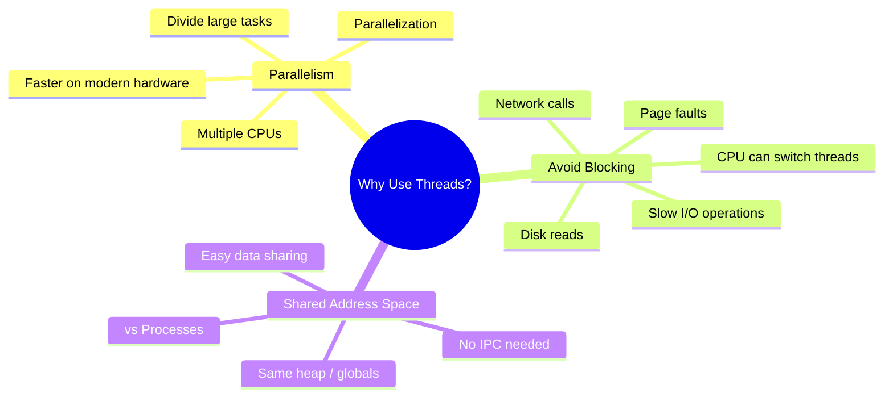
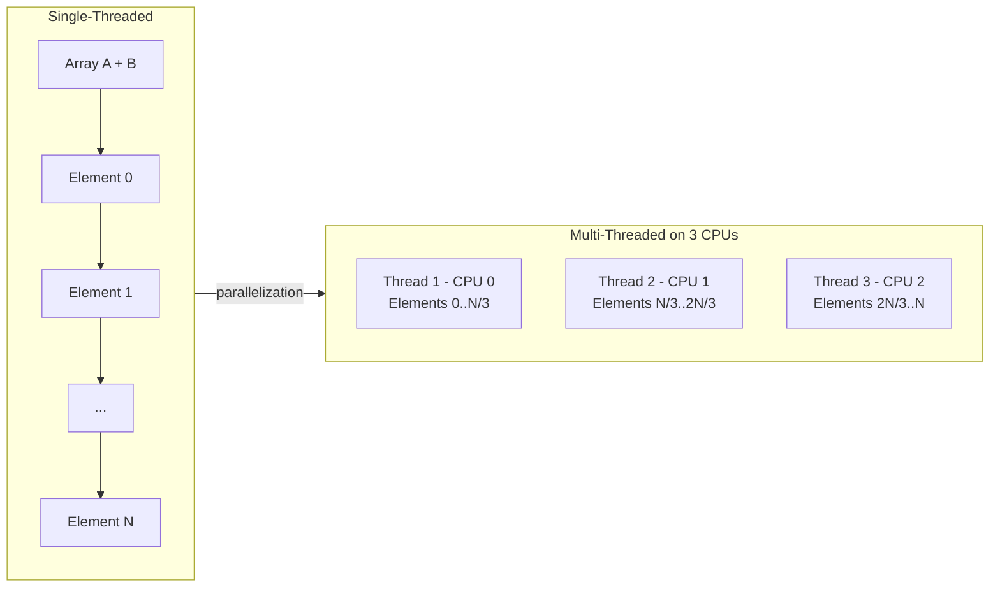
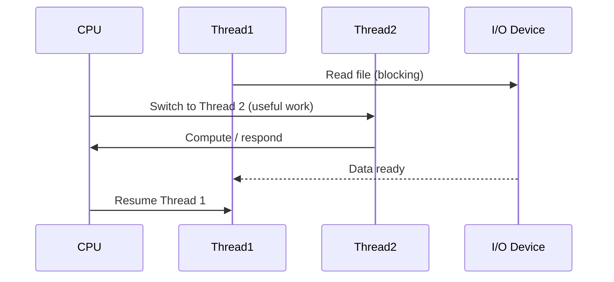
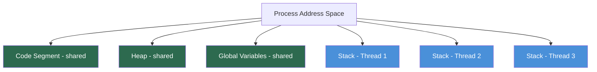

# � 02 — Why Use Threads?

> **Book:** Operating Systems: Three Easy Pieces (OSTEP) **Chapter:** 20 — Concurrency: Concurrency and Threads **Lesson:** 02 of 07 · Why Use Threads? **Source:** Educative.io

← [Back to Chapter 20](../README.md) | [Back to Book Index](../../README.md)

---

## 📌 Overview

Before diving into the problems of multi-threaded programming, we must answer a fundamental question: **Why use threads at all?** There are two primary and compelling reasons.

---

## 🗺️ Big Picture: Why Threads?

---

## ⚡ Reason 1: Parallelism

Imagine a program that adds two large arrays together. On a **single processor**, the work is sequential — element by element. But on a **multi-processor system**, we can split the array across multiple threads, one per CPU, dramatically speeding up the computation.

This transformation from single-threaded to multi-CPU execution is called **parallelization**.

> Using one thread per CPU to divide work is the natural and typical way to exploit modern hardware.

---

## ⏳ Reason 2: Avoiding Blocking (I/O Overlap)

When a program issues an I/O request (e.g., reading from disk), it may block waiting for the result. Instead of wasting CPU cycles, the OS can switch to **another thread** in the same process that has useful work to do.

This pattern is fundamental in servers (e.g., web servers, database engines) that must handle many concurrent requests.

---

## 🔄 Threads vs. Processes for Concurrency

| Feature | Threads | Processes |
|---|---|---|
| Address Space | **Shared** (same process) | Separate |
| Data Sharing | Easy (shared heap/globals) | Hard (requires IPC) |
| Communication | Low overhead | High overhead |
| Use Case | Web servers, DBs, compute | Logically separate tasks |
| Creation Cost | Low | Higher |

> **Key insight:** Threads share the same address space, making it easy to share data. Processes are better suited when tasks are logically separate and little sharing is needed.

---

## 📊 Key Concepts Summary

| Concept | Description |
|---|---|
| **Parallelism** | Using multiple threads to divide work across multiple CPUs |
| **Parallelization** | Converting single-threaded work to run on multiple CPUs |
| **Blocking I/O** | When a thread waits for a slow I/O op, wasting CPU time |
| **I/O Overlap** | Keeping the CPU busy by switching to other threads during I/O |
| **Shared Address Space** | All threads in a process share heap, code, and globals |
| **Per-thread Stack** | Each thread has its own private stack (registers, local vars) |

---

## ❓ Top Q&A

### Q1. What are the two main reasons for using threads?

**A:** 
1. **Parallelism** — to exploit multiple CPUs by dividing work across threads, speeding up computation.
2. **Avoiding blocking due to slow I/O** — while one thread waits for I/O, the CPU can run other threads to keep making progress.

---

### Q2. What is parallelization and why is it useful?

**A:** Parallelization is the process of transforming a single-threaded program into one that uses multiple threads to perform work on multiple CPUs simultaneously. It is useful because it can dramatically reduce execution time for compute-intensive tasks (e.g., large array operations) by dividing the work.

---

### Q3. How do threads help avoid the blocking problem during I/O?

**A:** When a thread initiates a slow I/O operation (disk read, network request, page fault), the CPU scheduler can context-switch to another ready thread instead of sitting idle. This allows the program to overlap computation with I/O, improving overall throughput.

---

### Q4. Why are threads preferred over processes for concurrent tasks that share data?

**A:** Threads share the same address space (code, heap, and global variables), so sharing data between threads is straightforward — no inter-process communication (IPC) mechanisms are needed. Processes have separate address spaces, making sharing expensive and complex.

---

### Q5. Why are processes still preferred in some cases over threads?

**A:** When tasks are **logically separate** and require **little or no shared data**, processes are preferred. Process isolation provides stronger fault isolation and security boundaries. If one process crashes, it doesn’t corrupt other processes’ memory.

---

### Q6. What is a typical use-case where threads shine?

**A:** Multi-threaded **web servers** and **database systems**. Each incoming request can be handled by a separate thread. Threads can share cached data, connection pools, and other resources efficiently because they share an address space.

---

### Q7. What does it mean for a thread to be "blocked"?

**A:** A thread is blocked when it is waiting for an event to occur (e.g., an I/O operation to complete, a lock to be released). While blocked, the thread cannot run and the OS scheduler can run another thread on the CPU.

---

### Q8. Does using threads automatically make a program faster?

**A:** Not necessarily. The benefit of parallelism only materializes if:
- The machine has multiple CPUs/cores.
- The work can be effectively divided (parallelizable).
- Synchronization overhead (locks, etc.) is manageable.

Poorly designed multi-threaded programs can be **slower** than single-threaded ones due to synchronization overhead and contention.

---

## 📝 Quick Recall Flashcards

| Question | Answer |
|---|---|
| Two reasons to use threads? | Parallelism + Avoid blocking I/O |
| What is parallelization? | Converting work to run across multiple CPUs using threads |
| What happens when a thread blocks on I/O? | CPU scheduler switches to another runnable thread |
| Do threads share address space? | Yes — same heap, code, globals; own stack |
| Threads vs Processes for data sharing? | Threads: easy (shared memory); Processes: hard (IPC) |
| When to prefer processes over threads? | Logically separate tasks with little data sharing |

---

*Notes generated from [Educative.io — Operating Systems: Virtualization, Concurrency & Persistence](https://www.educative.io/courses/operating-systems-virtualization-concurrency-persistence/why-use-threads)*
