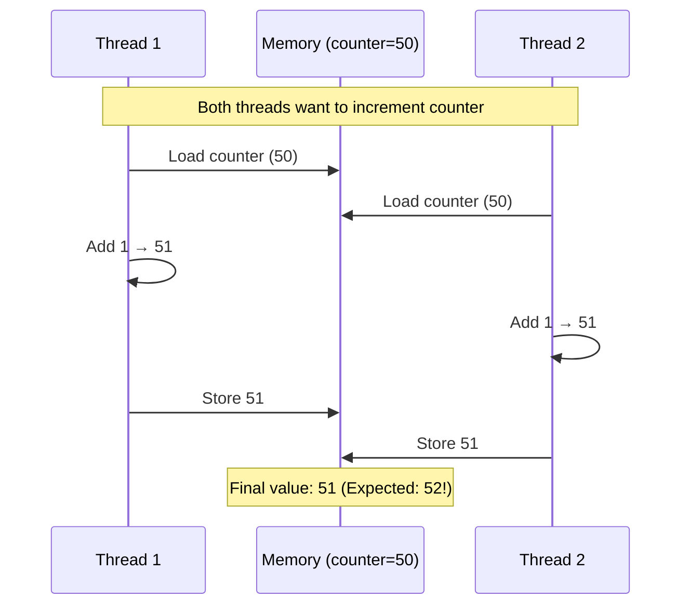
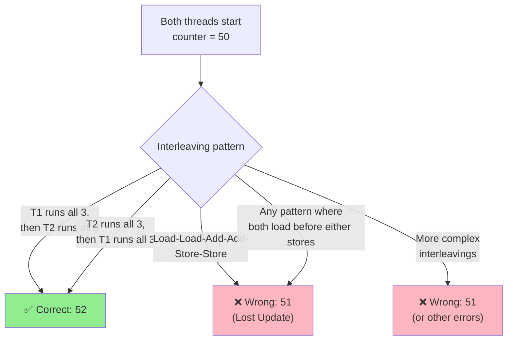
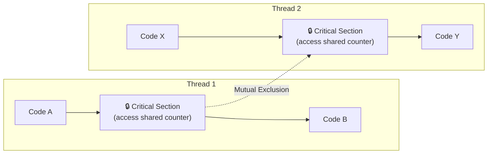
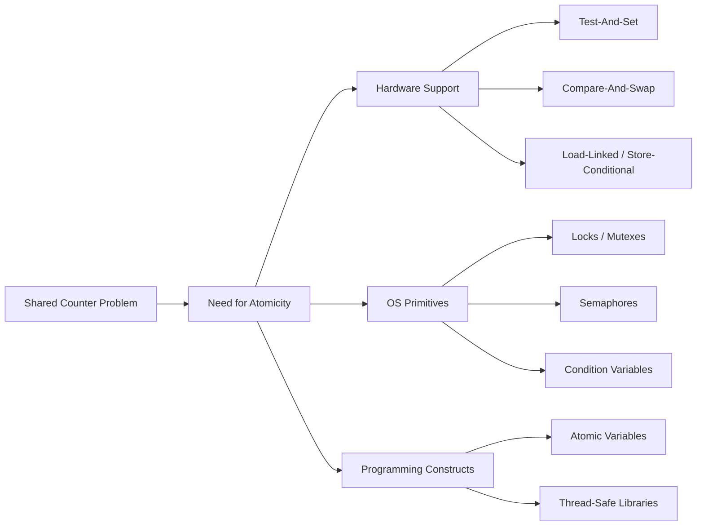

# 📘 Chapter 20 — Why It Gets Worse: Shared Data

> **Source:** Educative.io — *Operating Systems: Virtualization, Concurrency & Persistence* (OSTEP)  
> **Lesson:** Why It Gets Worse: Shared Data

---

## 📌 Overview

Once threads share data, simple and intuitive programs can produce **unpredictable and wrong results**. The root cause is that the CPU scheduler interleaves thread execution in ways the programmer cannot control, leading to **race conditions** when multiple threads access and modify the same variable concurrently.

---

## ⚡ The Core Problem: A Shared Counter

Consider two threads trying to increment a shared counter `count++`. The C code looks simple:

```c
void *mythread(void *arg) {
    counter = counter + 1;  // looks atomic, but it isn't!
}
```

### Why It Fails: The Assembly Breakdown

The compiler translates `counter++` into **three machine instructions**:

| Step | Instruction | Meaning |
|---|---|---|
| 1 | `mov` | Load counter from memory into a register |
| 2 | `add` | Increment the register by 1 |
| 3 | `mov` | Store the updated value back to memory |

These three steps are **not atomic**. The OS can switch threads between any of them, causing both threads to read the same old value, increment it, and write back the same new value — losing one update.

---

## 🗺️ Race Condition: Visualized

A race condition occurs when the final result depends on the **timing/interleaving** of thread execution.



### Possible Interleavings



---

## 🔥 Why "It Gets Worse"

| Aspect | Single Thread | Multiple Threads with Shared Data |
|---|---|---|
| **Execution** | Sequential, predictable | Interleaved, unpredictable |
| **Result** | Always correct | Sometimes correct, sometimes wrong |
| **Debugging** | Easy | Extremely hard — bugs may appear 1 in 1000 runs |
| **Reason** | No interruption | Uncontrolled scheduling by OS |

---

## 🏗️ The Critical Section

A **critical section** is a piece of code that accesses shared data and must not be executed by more than one thread at a time.



**Requirements for correctness:**
- **Mutual Exclusion:** Only one thread in the critical section at a time
- **Progress:** If no thread is in the critical section, one that wants to enter must be able to
- **Bounded Waiting:** No thread waits forever to enter

---

## 💡 The Wish for Atomicity



---

## 📊 Key Concepts Summary

| Term | Definition |
|---|---|
| **Race Condition** | Behavior depends on the relative timing of events; outcome is unpredictable |
| **Critical Section** | Code segment accessing shared resources that must execute mutually exclusively |
| **Atomic Operation** | An operation that completes entirely without interruption |
| **Mutual Exclusion** | Guarantee that only one thread accesses a shared resource at a time |
| **Lost Update** | When two threads read, modify, and write the same value, one update overwrites the other |
| **Determinism** | Single-threaded programs are deterministic; multi-threaded shared-data programs are not |

---

## ❓ Q&A — Most Important

### Q1. Why does shared data make multi-threading worse?
**A:** Because threads share the same address space, they can access the same variables. The OS scheduler interleaves their execution unpredictably. If multiple threads read and write shared data without coordination, the final result depends on timing, leading to race conditions and incorrect results.

### Q2. What is a race condition?
**A:** A race condition occurs when multiple threads or processes access shared data concurrently, and the outcome depends on the precise timing of their execution. The result can vary between runs, making bugs extremely difficult to reproduce and debug.

### Q3. Why isn't `counter++` atomic?
**A:** `counter++` compiles into three machine instructions: load from memory, increment in register, store back to memory. The OS can context-switch between any of these steps, allowing another thread to see or modify the value in between.

### Q4. What is a critical section?
**A:** A critical section is a block of code that accesses a shared resource. Only one thread should execute in its critical section at any given time to prevent race conditions. This property is called mutual exclusion.

### Q5. Why are bugs with shared data so hard to debug?
**A:** Because the OS scheduler decides when to switch threads, the problematic interleaving may occur very rarely (e.g., once in a thousand runs). The bug is non-deterministic and often disappears when you try to debug it.

### Q6. What is the "Lost Update" problem?
**A:** Two threads both read the same value (e.g., 50), both increment it to 51, and both write 51 back. The counter should be 52, but it ends up as 51 because one update was overwritten and lost.

### Q7. What is the solution to shared data problems?
**A:** Synchronization primitives like **locks (mutexes)**, **semaphores**, and **atomic operations** enforce mutual exclusion so only one thread accesses shared data at a time. Hardware support (e.g., test-and-set, compare-and-swap) is also required.

### Q8. Does using more threads always speed things up?
**A:** No. With shared data, threads spend time waiting for locks, and overhead from synchronization can make a program slower than a single-threaded version. Speedup only happens when work is truly parallelizable and synchronization overhead is low.

---

## 📝 Quick Recall Flashcards

| Question | Answer |
|---|---|
| Why does shared data make threading worse? | Uncontrolled scheduling leads to race conditions |
| What is a race condition? | Outcome depends on timing of thread execution |
| Is `counter++` one atomic operation? | No — it is 3 instructions (load, add, store) |
| What is a critical section? | Code accessing shared data; needs mutual exclusion |
| What is a lost update? | Two threads overwrite each other's increment |
| Why are these bugs hard to debug? | Non-deterministic; may happen rarely |
| What enforces mutual exclusion? | Locks, semaphores, atomic operations |
| What hardware support helps? | Test-and-Set, Compare-and-Swap |

---

## 🔗 References
- [Educative.io: Why It Gets Worse: Shared Data](https://www.educative.io/courses/operating-systems-virtualization-concurrency-persistence/why-it-gets-worse-shared-data)
- [OSTEP Chapter 26 PDF (Free)](https://pages.cs.wisc.edu/~remzi/OSTEP/threads-intro.pdf)
- Next: *The Heart of the Problem: Uncontrolled Scheduling*
