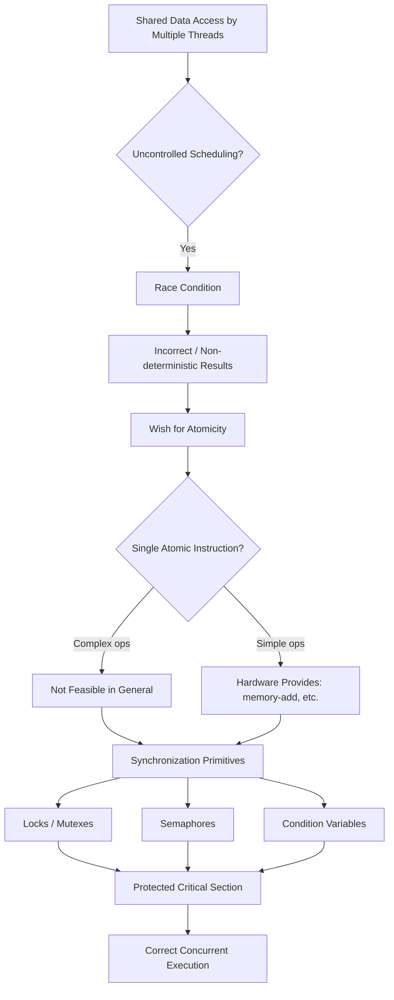
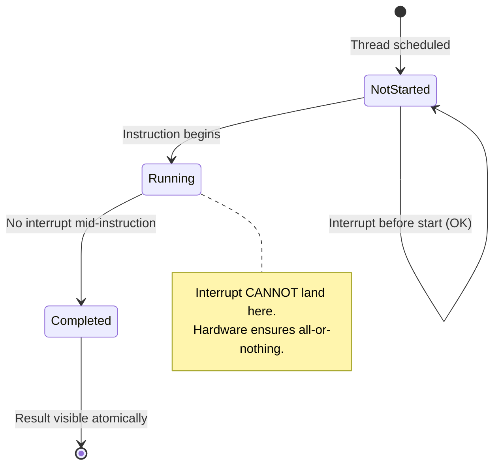
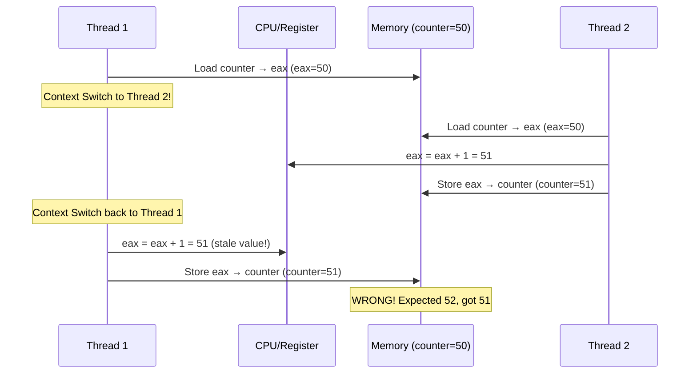
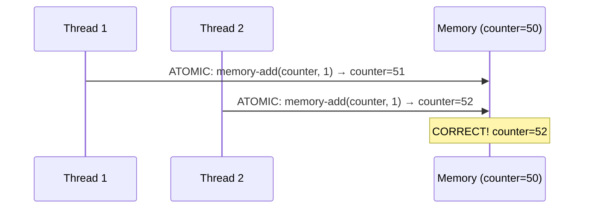

# 04 — The Wish For Atomicity

> **Course:** Operating Systems: Virtualization, Concurrency & Persistence
> **Section:** 20 — Concurrency: Concurrency and Threads
> **Topic:** Atomicity, Race Conditions, Synchronization Primitives

---

## 📌 Overview

This lesson builds on the **race condition** problem identified in the previous lesson (uncontrolled scheduling on shared data) and asks: *What is the ideal solution?*

The answer is **atomicity** — the ability to execute a sequence of instructions as a single, indivisible unit.

---

## 🧠 Core Concepts

### 1. The Problem Recap — Race Condition

When multiple threads access and modify shared data concurrently without coordination, the result depends on the **timing of thread scheduling** — this is called a **race condition**.

A classic example: two threads each incrementing a shared counter variable using three low-level instructions:

```asm
mov  0x8049a1c, %eax   ; Load counter from memory into register
add  $0x1,      %eax   ; Increment the register
mov  %eax, 0x8049a1c   ; Store result back to memory
```

If a context switch happens between any of these steps, the final counter value will be **wrong** (e.g., 19999 instead of 20000 after two threads each increment 10000 times).

---

### 2. The Wish for Atomicity

The ideal fix: what if the hardware provided a single instruction like:

```asm
memory-add 0x8049a1c, $0x1
```

This hypothetical **`memory-add`** instruction would:
- Load the value
- Increment it
- Store it back

…all **atomically** — no interrupt could occur in the middle.

**Why can't we just do this?**
- It works for *simple* operations (increment), but not for complex ones.
- Imagine needing an "atomic update of B-tree" instruction — hardware cannot provide every operation atomically.
- Therefore, hardware provides a **small set of atomic primitives** upon which the OS and developers build more powerful synchronization tools.

---

### 3. What Does "Atomic" Mean?

> **Atomic = "All or Nothing"**

- Either **all** of the grouped actions occur, or **none** of them do.
- No intermediate state is ever visible to other threads.
- When an interrupt occurs, the instruction either has **not run at all**, or has **run to completion** — there is no in-between.

The grouping of many actions into a single atomic action is called a **transaction** (a concept central to databases and distributed systems).

---

### 4. Synchronization Primitives

Since hardware can't provide atomic instructions for every operation, the solution is:

> Ask the hardware for a **small set of useful atomic instructions**, and use them to build **synchronization primitives**.

**Synchronization primitives** are tools (built using hardware + OS support) that allow developers to:
- Mark **critical sections** — code that must execute atomically
- Ensure only one thread accesses shared data at a time
- Coordinate thread execution reliably

Examples of synchronization primitives:
- **Locks / Mutexes**
- **Semaphores**
- **Condition Variables**

---

### 5. Critical Sections

A **critical section** is a sequence of code that:
- Accesses shared data
- Must be executed as if it were **atomic**
- Should not be interleaved with other threads accessing the same data

```
Thread 1                  Thread 2
────────────────────      ────────────────────
[CRITICAL SECTION]        (waiting / blocked)
  read counter
  increment
  write counter
────────────────────
                          [CRITICAL SECTION]
                            read counter
                            increment
                            write counter
                          ────────────────────
```

---

### 6. The Crux: How to Support Synchronization

> **THE CRUX:** What specific support is needed from **hardware** and the **OS** to build synchronization primitives correctly and efficiently?

The coming chapters answer this question, covering:
- Hardware atomic instructions (test-and-set, compare-and-swap, fetch-and-add)
- OS-level mechanisms (sleep/wakeup queues, futex)
- High-level primitives (locks, semaphores, condition variables)

---

## 🔁 Flow Diagram — From Race Condition to Synchronization



---

## 🔁 State Diagram — Atomic Instruction Guarantee



---

## 🔁 Sequence Diagram — Counter Increment Without Atomicity (Race Condition)



---

## 🔁 Sequence Diagram — Counter Increment WITH Atomicity (Correct)



---

## 📊 Summary Table

| Concept | Definition |
|---|---|
| **Atomicity** | A set of operations that appear as a single indivisible unit (all-or-nothing) |
| **Race Condition** | Bug caused by non-deterministic thread interleaving on shared data |
| **Critical Section** | Code that must execute atomically; only one thread at a time |
| **Transaction** | Multiple actions grouped into a single atomic operation (used in DBs) |
| **Synchronization Primitive** | Tool (lock, semaphore, CV) built on hardware atomics to protect critical sections |
| **memory-add** | Hypothetical single atomic instruction for increment (illustrative) |

---

## ❓ Most Important Questions & Answers

---

**Q1. What is atomicity in the context of concurrent systems?**

> **A:** Atomicity means a sequence of operations executes as a single, indivisible unit — either all operations complete or none do. No intermediate state is visible to other threads. This is expressed as "all or nothing."

---

**Q2. Why can't the hardware simply provide a single atomic instruction for every operation?**

> **A:** While hardware *can* provide atomic instructions for simple operations (like incrementing a memory location), it cannot do so for arbitrarily complex operations (like updating a B-tree). Providing an "atomic B-tree update" instruction for every possible data structure would be impractical. Instead, hardware provides a *small set* of atomic primitives that developers use to build higher-level synchronization tools.

---

**Q3. What is a race condition and when does it occur?**

> **A:** A race condition occurs when two or more threads access shared data concurrently without proper synchronization, and the final result depends on the order/timing of thread execution. For example, if two threads each try to increment a shared counter using load-increment-store, a context switch mid-sequence can cause one thread's update to be lost.

---

**Q4. What is a critical section?**

> **A:** A critical section is a segment of code that accesses shared resources (like shared variables) and must be executed by only one thread at a time. It must appear to execute atomically — threads must take turns entering and exiting the critical section.

---

**Q5. What are synchronization primitives and why are they needed?**

> **A:** Synchronization primitives are tools (locks, semaphores, condition variables) built using hardware-level atomic instructions and OS support. They are needed because the hardware cannot make all arbitrary sequences of instructions atomic, so developers use these primitives to protect critical sections and coordinate thread access to shared data.

---

**Q6. What is a transaction in the context of atomicity?**

> **A:** A transaction is the grouping of multiple actions into a single atomic action. Either all actions in the transaction complete, or none do. This concept is widely used in databases (ACID transactions) and file systems (journaling) to maintain consistency even in the presence of failures.

---

**Q7. What guarantee does the hardware provide when an interrupt occurs during an instruction?**

> **A:** The hardware guarantees that when an interrupt occurs, the instruction either has **not run at all** or has **run to completion**. There is no in-between state. This is the foundation of atomicity at the hardware level.

---

**Q8. What is the "crux" problem introduced in this lesson?**

> **A:** The crux is: *What specific support is needed from the hardware and the operating system to build synchronization primitives correctly and efficiently?* This sets up the next several chapters which explore hardware atomic instructions (test-and-set, CAS, fetch-and-add) and OS-level synchronization mechanisms.

---

**Q9. Why does the three-instruction sequence (load, add, store) for incrementing a counter fail in a concurrent environment?**

> **A:** Because a context switch can occur between any of the three instructions. If Thread 1 loads the counter value into a register and is then preempted, Thread 2 can load the *same* (stale) value, increment it, and store it. When Thread 1 resumes, it operates on its stale register value, effectively overwriting Thread 2's update. The increment is "lost."

---

**Q10. How does atomicity differ from simply "being fast"?**

> **A:** Speed is irrelevant — atomicity is about **visibility**. An atomic operation guarantees that no other thread can observe a partial state of the operation. Even a slow atomic operation is correct; a fast non-atomic operation is not safe in concurrent code.

---

## 🔑 Key Takeaways

1. **Race conditions** arise from uncontrolled access to shared data across threads.
2. The ideal solution is **atomicity** — execute sequences as a single unit.
3. Hardware provides only **limited atomic primitives**; complex atomicity must be built on top.
4. **Synchronization primitives** (locks, semaphores, CVs) are the bridge between hardware atomics and safe multi-threaded code.
5. **Critical sections** must be protected so only one thread executes them at a time.
6. The concept of **transactions** generalizes atomicity — used in DBs, file systems, and distributed systems.

---

*Source: Educative.io — Operating Systems: Virtualization, Concurrency & Persistence — Chapter 20: Concurrency and Threads — Lesson: The Wish For Atomicity*
