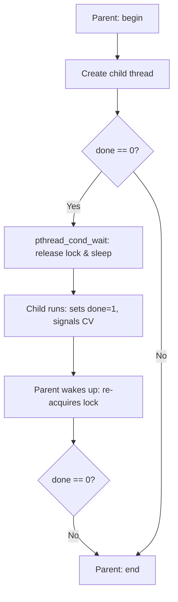
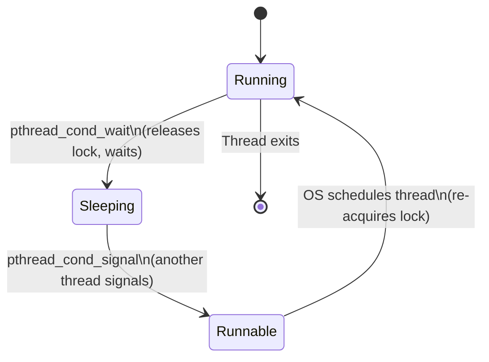
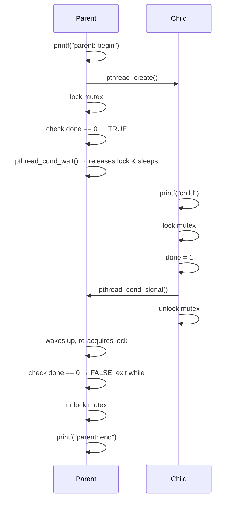
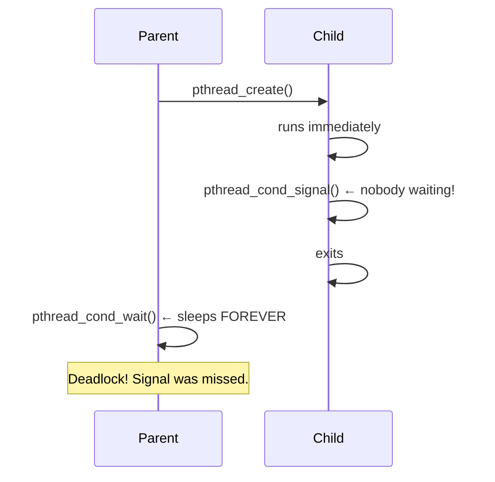

# 05 — One More Problem: Waiting For Another

> **Course:** Operating Systems: Virtualization, Concurrency & Persistence
> **Section:** 20 — Concurrency: Concurrency and Threads
> **Topic:** Thread Synchronization, Sleeping & Waking, Condition Variables

---

## 📌 Overview

This lesson introduces a **second fundamental concurrency problem** beyond mutual exclusion: one thread needing to **wait for another thread** to complete some action before it can proceed.

While locks solve the problem of protecting critical sections (mutual exclusion), they are not sufficient when threads need to **coordinate** — i.e., when Thread A must pause and wait until Thread B signals that some condition is true.

---

## 🧠 Core Concepts

### 1. The New Problem — Waiting for a Condition

The problem arises in scenarios like:

- A **parent thread** creates a child thread and must wait for it to **finish** before continuing.
- A **consumer thread** must wait for a **producer thread** to put something into a buffer before consuming it.

This is fundamentally different from mutual exclusion — it's about **ordering and signaling** between threads.

**Example scenario:**

```c
void *child(void *arg) {
    printf("child\n");
    // signal parent that we're done
    return NULL;
}

int main(int argc, char *argv[]) {
    printf("parent: begin\n");
    pthread_t c;
    pthread_create(&c, NULL, child, NULL);
    // HOW does the parent wait here?
    printf("parent: end\n");
    return 0;
}
```

The question is: **How does the parent know when the child is done?**

---

### 2. A Broken Approach — Spin-Waiting

One naive approach is to have the parent **spin in a loop** checking a shared flag:

```c
volatile int done = 0;

void *child(void *arg) {
    printf("child\n");
    done = 1;  // signal
    return NULL;
}

int main(int argc, char *argv[]) {
    printf("parent: begin\n");
    pthread_t c;
    pthread_create(&c, NULL, child, NULL);
    while (done == 0)
        ;  // spin-wait — wastes CPU!
    printf("parent: end\n");
    return 0;
}
```

**Why this is bad:**
- It **wastes CPU cycles** — the parent is constantly running and checking a flag.
- It is **inefficient** — the parent should sleep and be woken up only when the child is done.

---

### 3. The Right Solution — Condition Variables

The correct approach is to use a **condition variable** — a synchronization primitive that allows a thread to:

1. **Sleep** (`wait`) until a condition becomes true.
2. **Wake up** (`signal`) another sleeping thread once the condition is satisfied.

A condition variable is used **together with a lock (mutex)**.

**Key POSIX calls:**

| Call | Description |
|------|-------------|
| `pthread_cond_wait(cond, mutex)` | Atomically releases the lock and puts the thread to sleep; re-acquires the lock on wake-up |
| `pthread_cond_signal(cond)` | Wakes up one thread sleeping on the condition variable |

---

### 4. Correct Parent–Child Synchronization

```c
int done = 0;
pthread_mutex_t m = PTHREAD_MUTEX_INITIALIZER;
pthread_cond_t c = PTHREAD_COND_INITIALIZER;

void thr_exit() {
    pthread_mutex_lock(&m);
    done = 1;
    pthread_cond_signal(&c);
    pthread_mutex_unlock(&m);
}

void *child(void *arg) {
    printf("child\n");
    thr_exit();
    return NULL;
}

void thr_join() {
    pthread_mutex_lock(&m);
    while (done == 0)
        pthread_cond_wait(&c, &m);
    pthread_mutex_unlock(&m);
}

int main(int argc, char *argv[]) {
    printf("parent: begin\n");
    pthread_t p;
    pthread_create(&p, NULL, child, NULL);
    thr_join();
    printf("parent: end\n");
    return 0;
}
```

**Why `while` not `if`?**
- Always use `while` to re-check the condition after waking up — a thread may be woken spuriously or the condition may have been altered by another thread.

---

### 5. Why the `done` Flag is Necessary

You might wonder: why not just call `pthread_cond_wait` without checking `done`?

**Consider this race:**
1. Parent creates child.
2. Child runs **immediately**, calls `thr_exit()`, signals — but **no one is waiting yet**.
3. Parent then calls `thr_join()` → calls `pthread_cond_wait()` → **sleeps forever** — no one will signal again!

The `done` flag handles this race:
- If the child finishes **before** the parent waits, `done == 1` → parent skips `wait` entirely.
- If the parent waits **before** the child finishes, `done == 0` → parent sleeps correctly and is woken by the child.

---

### 6. Why the Lock is Necessary

Removing the lock causes another race:

1. Parent checks `done == 0` → decides to sleep.
2. **Before** calling `wait`, context switch to child → child sets `done = 1`, signals (no one is sleeping).
3. Parent resumes → calls `wait` → **sleeps forever**.

The lock ensures the **check and the sleep happen atomically**, preventing this window.

---

## 🔁 Flow Diagram — Parent Waiting for Child



---

## 🔁 State Diagram — Thread States with Condition Variable



---

## 🔁 Sequence Diagram — Correct Synchronization (No Race)



---

## 🔁 Sequence Diagram — Race Without `done` Flag



---

## 📊 Summary Table

| Concept | Description |
|---------|-------------|
| **Spin-waiting** | Repeatedly checking a flag in a loop — correct but wastes CPU |
| **Condition Variable (CV)** | Synchronization primitive to sleep until a condition is met |
| `pthread_cond_wait` | Atomically releases lock and sleeps; re-acquires lock on wake |
| `pthread_cond_signal` | Wakes one thread sleeping on the CV |
| **`done` flag** | State variable that prevents missed signals when child finishes before parent waits |
| **Lock with CV** | Mutex must always be held when calling `wait` or `signal` to avoid race conditions |
| **`while` vs `if`** | Always use `while` to re-check condition after waking — guards against spurious wakeups |

---

## ❓ Most Important Questions & Answers

**Q1. What is the second fundamental concurrency problem introduced in this lesson?**

> **A:** The problem of one thread **waiting for another** to complete some action. Unlike mutual exclusion (protecting shared data), this is about **coordination** — Thread A must sleep until Thread B signals that a condition has been satisfied (e.g., child thread is done, buffer has data).

**Q2. Why is spin-waiting a poor solution for thread coordination?**

> **A:** Spin-waiting wastes CPU cycles by keeping the waiting thread in an active loop doing nothing useful. It is correct but highly inefficient — the OS should put the thread to sleep so other threads can use the CPU productively.

**Q3. What is a condition variable and how does it solve the waiting problem?**

> **A:** A condition variable is a synchronization primitive that allows a thread to atomically release a lock and go to sleep, waiting until another thread signals it. The woken thread then re-acquires the lock and continues. This avoids spin-waiting and is CPU-efficient.

**Q4. Why must `pthread_cond_wait` be called while holding a lock?**

> **A:** Without the lock, a race condition can occur: the waiting thread checks the condition, decides to sleep, but before calling `wait` a context switch hands control to the signaling thread which signals (no one is sleeping yet). When the waiting thread resumes and calls `wait`, it sleeps forever — the signal was missed. The lock prevents this window.

**Q5. Why is a `done` state variable needed alongside the condition variable?**

> **A:** The `done` flag handles the case where the child finishes **before** the parent even calls `wait`. Without `done`, the parent would call `wait`, miss the already-sent signal, and sleep forever. With `done`, the parent checks the flag first — if already set, it skips waiting entirely.

**Q6. Why should `pthread_cond_wait` be called inside a `while` loop rather than an `if` statement?**

> **A:** Because of **spurious wakeups** — a thread can be woken by the OS even without an explicit signal. Also, between waking and re-acquiring the lock, another thread might have changed the condition. Using `while` ensures the condition is re-checked every time the thread wakes, guaranteeing correctness.

**Q7. What are the two cases the correct `thr_join` / `thr_exit` solution handles?**

> **A:** (1) **Parent waits before child finishes** — parent calls `wait`, child eventually signals and wakes parent. (2) **Child finishes before parent waits** — child sets `done = 1` and signals, parent later checks `done == 1` and skips `wait` entirely. Both cases work correctly with the lock + CV + `done` flag pattern.

**Q8. How does `pthread_cond_wait` atomically release the lock and sleep?**

> **A:** `pthread_cond_wait` is designed as an atomic operation by the threading library: it simultaneously releases the mutex and registers the thread on the condition variable's wait queue. This atomicity is what prevents the missed-signal race — there is no gap between releasing the lock and starting to wait.

---

## 🔑 Key Takeaways

1. **Mutual exclusion** (locks) solves shared data protection — but **coordination** between threads requires condition variables.
2. **Spin-waiting** is functionally correct but CPU-wasteful; always prefer sleeping via a condition variable.
3. The pattern is always: **lock → check condition in while loop → wait → unlock**.
4. A **state variable** (like `done`) is essential to handle the case where the signal is sent before the waiter is ready.
5. Always hold the **lock** when calling `pthread_cond_wait` or `pthread_cond_signal`.
6. Use `while`, not `if`, to re-check the condition after waking up — guard against spurious wakeups.

---

*Source: Educative.io — Operating Systems: Virtualization, Concurrency & Persistence — Chapter 20: Concurrency and Threads — Lesson: One More Problem: Waiting For Another*
