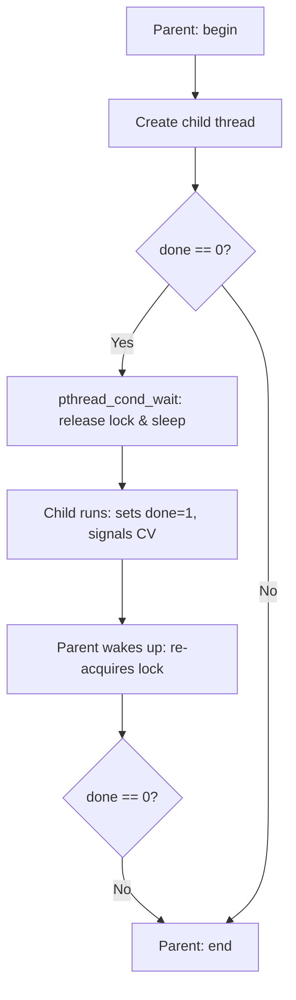
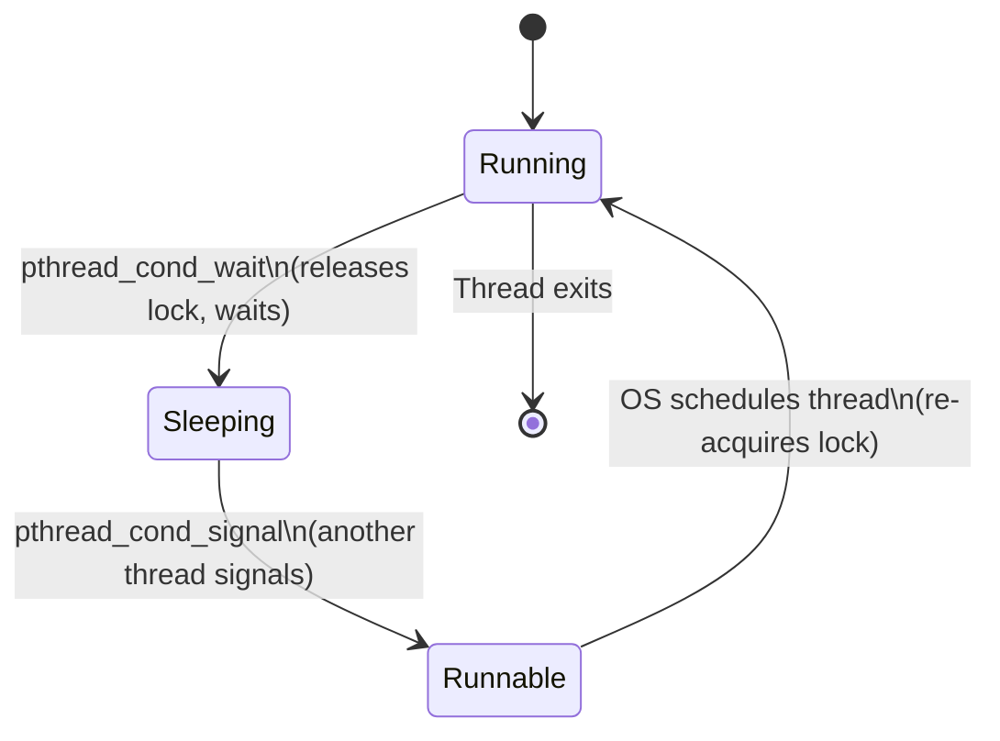
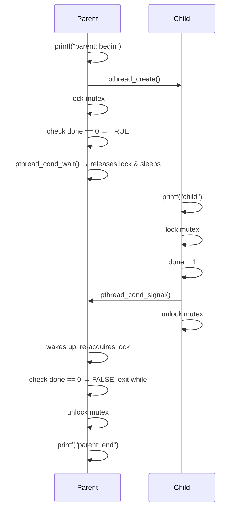
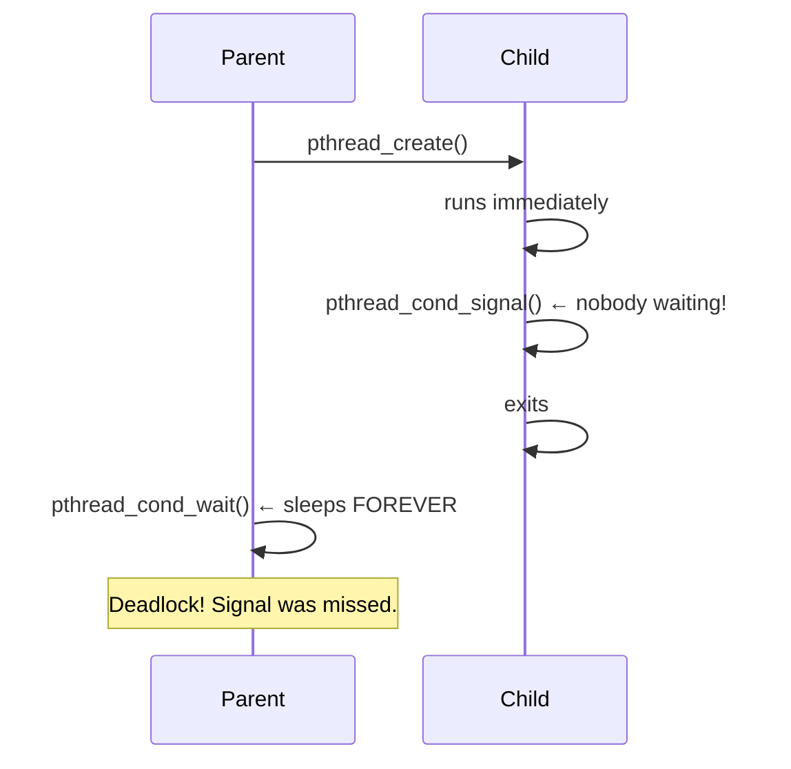

# 05 — One More Problem: Waiting For Another

> **Course:** Operating Systems: Virtualization, Concurrency & Persistence
> **Section:** 20 — Concurrency: Concurrency and Threads
> **Topic:** Thread Synchronization, Sleeping & Waking, Condition Variables

---

## 📌 Overview

This lesson introduces a **second fundamental concurrency problem** beyond mutual exclusion: one thread needing to **wait for another thread** to complete some action before it can proceed.

While locks solve the problem of protecting critical sections (mutual exclusion), they are not sufficient when threads need to **coordinate** — i.e., when Thread A must pause and wait until Thread B signals that some condition is true.

---

## 🧠 Core Concepts

### 1. The New Problem — Waiting for a Condition

The problem arises in scenarios like:

- A **parent thread** creates a child thread and must wait for it to **finish** before continuing.
- A **consumer thread** must wait for a **producer thread** to put something into a buffer before consuming it.

This is fundamentally different from mutual exclusion — it's about **ordering and signaling** between threads.

**Example scenario:**

```c
void *child(void *arg) {
    printf("child\n");
    // signal parent that we're done
    return NULL;
}

int main(int argc, char *argv[]) {
    printf("parent: begin\n");
    pthread_t c;
    pthread_create(&c, NULL, child, NULL);
    // HOW does the parent wait here?
    printf("parent: end\n");
    return 0;
}
```

The question is: **How does the parent know when the child is done?**

---

### 2. A Broken Approach — Spin-Waiting

One naive approach is to have the parent **spin in a loop** checking a shared flag:

```c
volatile int done = 0;

void *child(void *arg) {
    printf("child\n");
    done = 1;  // signal
    return NULL;
}

int main(int argc, char *argv[]) {
    printf("parent: begin\n");
    pthread_t c;
    pthread_create(&c, NULL, child, NULL);
    while (done == 0)
        ;  // spin-wait — wastes CPU!
    printf("parent: end\n");
    return 0;
}
```

**Why this is bad:**
- It **wastes CPU cycles** — the parent is constantly running and checking a flag.
- It is **inefficient** — the parent should sleep and be woken up only when the child is done.

---

### 3. The Right Solution — Condition Variables

The correct approach is to use a **condition variable** — a synchronization primitive that allows a thread to:

1. **Sleep** (`wait`) until a condition becomes true.
2. **Wake up** (`signal`) another sleeping thread once the condition is satisfied.

A condition variable is used **together with a lock (mutex)**.

**Key POSIX calls:**

| Call | Description |
|------|-------------|
| `pthread_cond_wait(cond, mutex)` | Atomically releases the lock and puts the thread to sleep; re-acquires the lock on wake-up |
| `pthread_cond_signal(cond)` | Wakes up one thread sleeping on the condition variable |

---

### 4. Correct Parent–Child Synchronization

```c
int done = 0;
pthread_mutex_t m = PTHREAD_MUTEX_INITIALIZER;
pthread_cond_t c = PTHREAD_COND_INITIALIZER;

void thr_exit() {
    pthread_mutex_lock(&m);
    done = 1;
    pthread_cond_signal(&c);
    pthread_mutex_unlock(&m);
}

void *child(void *arg) {
    printf("child\n");
    thr_exit();
    return NULL;
}

void thr_join() {
    pthread_mutex_lock(&m);
    while (done == 0)
        pthread_cond_wait(&c, &m);
    pthread_mutex_unlock(&m);
}

int main(int argc, char *argv[]) {
    printf("parent: begin\n");
    pthread_t p;
    pthread_create(&p, NULL, child, NULL);
    thr_join();
    printf("parent: end\n");
    return 0;
}
```

**Why `while` not `if`?**
- Always use `while` to re-check the condition after waking up — a thread may be woken spuriously or the condition may have been altered by another thread.

---

### 5. Why the `done` Flag is Necessary

You might wonder: why not just call `pthread_cond_wait` without checking `done`?

**Consider this race:**
1. Parent creates child.
2. Child runs **immediately**, calls `thr_exit()`, signals — but **no one is waiting yet**.
3. Parent then calls `thr_join()` → calls `pthread_cond_wait()` → **sleeps forever** — no one will signal again!

The `done` flag handles this race:
- If the child finishes **before** the parent waits, `done == 1` → parent skips `wait` entirely.
- If the parent waits **before** the child finishes, `done == 0` → parent sleeps correctly and is woken by the child.

---

### 6. Why the Lock is Necessary

Removing the lock causes another race:

1. Parent checks `done == 0` → decides to sleep.
2. **Before** calling `wait`, context switch to child → child sets `done = 1`, signals (no one is sleeping).
3. Parent resumes → calls `wait` → **sleeps forever**.

The lock ensures the **check and the sleep happen atomically**, preventing this window.

---

## 🔁 Flow Diagram — Parent Waiting for Child



---

## 🔁 State Diagram — Thread States with Condition Variable



---

## 🔁 Sequence Diagram — Correct Synchronization (No Race)



---

## 🔁 Sequence Diagram — Race Without `done` Flag



---

## 📊 Summary Table

| Concept | Description |
|---------|-------------|
| **Spin-waiting** | Repeatedly checking a flag in a loop — correct but wastes CPU |
| **Condition Variable (CV)** | Synchronization primitive to sleep until a condition is met |
| `pthread_cond_wait` | Atomically releases lock and sleeps; re-acquires lock on wake |
| `pthread_cond_signal` | Wakes one thread sleeping on the CV |
| **`done` flag** | State variable that prevents missed signals when child finishes before parent waits |
| **Lock with CV** | Mutex must always be held when calling `wait` or `signal` to avoid race conditions |
| **`while` vs `if`** | Always use `while` to re-check condition after waking — guards against spurious wakeups |

---

## ❓ Most Important Questions & Answers

**Q1. What is the second fundamental concurrency problem introduced in this lesson?**

> **A:** The problem of one thread **waiting for another** to complete some action. Unlike mutual exclusion (protecting shared data), this is about **coordination** — Thread A must sleep until Thread B signals that a condition has been satisfied (e.g., child thread is done, buffer has data).

**Q2. Why is spin-waiting a poor solution for thread coordination?**

> **A:** Spin-waiting wastes CPU cycles by keeping the waiting thread in an active loop doing nothing useful. It is correct but highly inefficient — the OS should put the thread to sleep so other threads can use the CPU productively.

**Q3. What is a condition variable and how does it solve the waiting problem?**

> **A:** A condition variable is a synchronization primitive that allows a thread to atomically release a lock and go to sleep, waiting until another thread signals it. The woken thread then re-acquires the lock and continues. This avoids spin-waiting and is CPU-efficient.

**Q4. Why must `pthread_cond_wait` be called while holding a lock?**

> **A:** Without the lock, a race condition can occur: the waiting thread checks the condition, decides to sleep, but before calling `wait` a context switch hands control to the signaling thread which signals (no one is sleeping yet). When the waiting thread resumes and calls `wait`, it sleeps forever — the signal was missed. The lock prevents this window.

**Q5. Why is a `done` state variable needed alongside the condition variable?**

> **A:** The `done` flag handles the case where the child finishes **before** the parent even calls `wait`. Without `done`, the parent would call `wait`, miss the already-sent signal, and sleep forever. With `done`, the parent checks the flag first — if already set, it skips waiting entirely.

**Q6. Why should `pthread_cond_wait` be called inside a `while` loop rather than an `if` statement?**

> **A:** Because of **spurious wakeups** — a thread can be woken by the OS even without an explicit signal. Also, between waking and re-acquiring the lock, another thread might have changed the condition. Using `while` ensures the condition is re-checked every time the thread wakes, guaranteeing correctness.

**Q7. What are the two cases the correct `thr_join` / `thr_exit` solution handles?**

> **A:** (1) **Parent waits before child finishes** — parent calls `wait`, child eventually signals and wakes parent. (2) **Child finishes before parent waits** — child sets `done = 1` and signals, parent later checks `done == 1` and skips `wait` entirely. Both cases work correctly with the lock + CV + `done` flag pattern.

**Q8. How does `pthread_cond_wait` atomically release the lock and sleep?**

> **A:** `pthread_cond_wait` is designed as an atomic operation by the threading library: it simultaneously releases the mutex and registers the thread on the condition variable's wait queue. This atomicity is what prevents the missed-signal race — there is no gap between releasing the lock and starting to wait.

---

## 🔑 Key Takeaways

1. **Mutual exclusion** (locks) solves shared data protection — but **coordination** between threads requires condition variables.
2. **Spin-waiting** is functionally correct but CPU-wasteful; always prefer sleeping via a condition variable.
3. The pattern is always: **lock → check condition in while loop → wait → unlock**.
4. A **state variable** (like `done`) is essential to handle the case where the signal is sent before the waiter is ready.
5. Always hold the **lock** when calling `pthread_cond_wait` or `pthread_cond_signal`.
6. Use `while`, not `if`, to re-check the condition after waking up — guard against spurious wakeups.

---

*Source: Educative.io — Operating Systems: Virtualization, Concurrency & Persistence — Chapter 20: Concurrency and Threads — Lesson: One More Problem: Waiting For Another*


---

## 🧪 Exercise — Simulator Questions & Answers

> **Tool:** `x86.py` — the OSTEP thread simulator
> **Programs used:** `loop.s`, `looping-race-nolock.s`, `wait-for-me.s`

---

### Q1. Run `loop.s` with a single thread (`-t 1 -i 100 -R dx`). What will `%dx` be?

**Command:** `./x86.py -p loop.s -t 1 -i 100 -R dx`

**Answer:**

`loop.s` decrements `%dx` in a loop until it reaches 0. With a single thread and `-i 100` (interrupt every 100 instructions), there are no race conditions. Starting from the default initial value of `%dx = 0`, the loop body subtracts 1 and tests; since `%dx` starts at 0, the loop exits immediately. Use `-c` to confirm.

- **`%dx` = 0** throughout (loop does not execute because `%dx` starts at 0 and the test-and-branch exits immediately).

---

### Q2. Run `loop.s` with two threads (`-t 2 -i 100 -a dx=3,dx=3 -R dx`). What values does `%dx` see? Is there a race?

**Command:** `./x86.py -p loop.s -t 2 -i 100 -a dx=3,dx=3 -R dx`

**Answer:**

Each thread gets its **own private register set**, so `%dx` is not shared — it is a per-thread register. Thread 0 starts with `%dx=3` and counts down: 3, 2, 1, 0. Thread 1 does the same independently.

- **No race condition** — `%dx` is a register, not shared memory. Each thread has its own copy.
- The values you will see for each thread are: **3, 2, 1, 0** (counting down to 0).

---

### Q3. Run `loop.s` with random interrupt intervals (`-t 2 -i 3 -r -a dx=3,dx=3 -R dx`). Does interrupt frequency change anything?

**Command:** `./x86.py -p loop.s -t 2 -i 3 -r -a dx=3,dx=3 -R dx`

**Answer:**

Since `%dx` is a **per-thread register** (not shared memory), the interrupt frequency and interleaving do **not** change the final result. Each thread still counts its own `%dx` from 3 down to 0 correctly.

- **No**, the interrupt frequency does not matter for `loop.s` — registers are private to each thread. The result is always correct regardless of scheduling.

---

### Q4. Run `looping-race-nolock.s` with one thread (`-t 1 -M 2000`). What is `value` throughout the run?

**Command:** `./x86.py -p looping-race-nolock.s -t 1 -M 2000`

**Answer:**

With a single thread, there is no concurrency issue. The program loads `value` from address 2000, increments it, and stores it back — atomically from the perspective of a single thread. Starting at `value = 0`, after each iteration it increments by 1.

- `value` at address 2000 increments from **0 → 1** (default loop count is 1, so it ends at **1**).
- Use `-c` to verify: the memory trace will show `2000 = 0` before the store and `2000 = 1` after.

---

### Q5. Run `looping-race-nolock.s` with two threads (`-t 2 -a bx=3 -M 2000`). What is the final value? Why does each thread loop 3 times?

**Command:** `./x86.py -p looping-race-nolock.s -t 2 -a bx=3 -M 2000`

**Answer:**

`%bx` is the loop counter — each thread loops `bx+1 = 4` times... actually `bx=3` means loop 3 times (the loop decrements `%bx` until 0). Each thread does 3 load-increment-store operations on the **shared** `value` at address 2000.

- **Expected (correct) result:** `value = 6` (2 threads × 3 increments each).
- **Actual result may be less than 6** due to the race condition — if one thread loads `value`, gets interrupted, and the other thread also loads and stores before the first thread stores, the first thread overwrites the second thread's update (lost update problem).
- The final value will be **between 2 and 6** depending on the interleaving. With `-i 100` (default), likely **6** since each thread completes without interruption.

---

### Q6. Run with random interrupts (`-t 2 -M 2000 -i 4 -r -s 0`). What is the final value? Where is the critical section?

**Command:** `./x86.py -p looping-race-nolock.s -t 2 -M 2000 -i 4 -r -s 0`

**Answer:**

With small, random interrupt intervals, context switches can occur **inside** the load-increment-store sequence, creating a race condition.

**The critical section** is the three-instruction sequence:
```
mov 2000, %ax   # load value
add $1, %ax     # increment
mov %ax, 2000   # store value back
```
A race occurs if Thread 1 is interrupted **between the load and the store** — Thread 2 then loads the old value, both compute `value+1`, and both store back `value+1` instead of `value+2`. The timing matters: interrupts **inside** the critical section (between load and store) cause lost updates.

- With seed `-s 0`, use `-c` to trace the interleaving and determine the exact final value.
- The final value can be **less than 6** (e.g., 4 or 5) due to lost updates.

---

### Q7. Use `-a bx=1 -t 2 -M 2000` and vary `-i`. Which interrupt intervals guarantee the correct result?

**Command:** `./x86.py -p looping-race-nolock.s -a bx=1 -t 2 -M 2000 -i <N>`

**Answer:**

The critical section is **3 instructions** long (load, add, store). A race occurs only when a context switch happens **inside** those 3 instructions.

- **Safe interrupt intervals:** Any interval that causes interrupts **only outside** the critical section. Specifically, if `i >= 3` AND the interrupt always lands between complete iterations (e.g., `-i 3` or multiples that align with the 3-instruction critical section boundary) are safe.
- **Unsafe intervals:** `-i 1` or `-i 2` — interrupts that can split the load-add-store sequence.
- **Key insight:** With `bx=1`, each thread does 1 iteration = 3 critical instructions + loop overhead. An interrupt interval of **3 or more** that lands cleanly after the store is safe.

---

### Q8. Use `-a bx=100 -t 2 -M 2000` and vary `-i`. Which intervals give correct results?

**Command:** `./x86.py -p looping-race-nolock.s -a bx=100 -t 2 -M 2000 -i <N>`

**Answer:**

With `bx=100`, each thread does 100 iterations. The total instructions per thread = ~400 (4 instructions per loop: load, add, store, loop-back).

- **Correct result:** `value = 200`
- **Safe intervals:** Very large values of `-i` (e.g., `i >= 400`) that let each thread complete entirely before the other runs, eliminating interleaving. Or intervals that always interrupt between full iterations of the critical section.
- **Surprising (incorrect) results:** Small `-i` values (1–3) will frequently split the critical section, causing many lost updates. The result could be as low as **101** (worst case, almost all updates from one thread are lost).
- **Key insight:** The larger `bx` is, the more opportunities for races at any small interrupt interval. Only very large intervals (or a lock) guarantee correctness.

---

### Q9. Run `wait-for-me.s` (`-a ax=1,ax=0 -R ax -M 2000`). How is memory location 2000 used?

**Command:** `./x86.py -p wait-for-me.s -a ax=1,ax=0 -R ax -M 2000`

**Answer:**

In `wait-for-me.s`, `%ax` determines the role of each thread:
- Thread 0 has `ax=1` → it is the **signaler** (child): it does its work and then sets `mem[2000] = 1` to signal completion.
- Thread 1 has `ax=0` → it is the **waiter** (parent): it spins in a loop checking `mem[2000]` until it becomes 1.

**Memory location 2000 is used as a shared flag / condition variable:**
- Initially `mem[2000] = 0` (not done).
- The signaler sets `mem[2000] = 1` when finished.
- The waiter spins reading `mem[2000]` in a loop (spin-wait) until it sees the value 1.

This demonstrates **spin-waiting** for synchronization — correct but CPU-wasteful.

---

### Q10. Swap roles (`-a ax=0,ax=1 -R ax -M 2000`). How does thread behavior change? Is spin-waiting efficient?

**Command:** `./x86.py -p wait-for-me.s -a ax=0,ax=1 -R ax -M 2000`

**Answer:**

With the flags swapped:
- Thread 0 has `ax=0` → it is now the **waiter**: it immediately starts spinning on `mem[2000]`.
- Thread 1 has `ax=1` → it is now the **signaler**: it will eventually set `mem[2000] = 1`.

**Thread behavior:**
- Thread 0 (waiter) runs first and spins in a tight loop checking `mem[2000]` — **consuming CPU cycles doing no useful work**.
- When Thread 1 eventually runs, it sets `mem[2000] = 1`, and Thread 0 exits the spin loop.

**CPU Efficiency — Spin-waiting is very inefficient:**
- The waiter thread burns CPU cycles in a hot loop polling memory.
- The more frequent the interrupts (small `-i`), the more often Thread 0 gets to run, wasting more CPU time spinning.
- **Decreasing interrupt interval** (smaller `-i`) makes it worse — Thread 0 spins more often before Thread 1 gets a chance to signal.
- **Increasing interrupt interval** (larger `-i`) could mean Thread 0 spins for a long time before being interrupted, but Thread 1 gets to run and signal sooner — still wasteful.

**The fix:** Replace spin-waiting with `pthread_cond_wait()` — the OS puts the waiting thread to sleep (off the CPU) until signaled, eliminating wasted CPU cycles. This is exactly the lesson of this chapter.
