# Operating Systems: Virtualization, Concurrency & Persistence

> 📚 Notes from [Educative.io](https://www.educative.io/courses/operating-systems-virtualization-concurrency-persistence) | Chapter 20: Concurrency and Threads

---

## 🧵 Introduction to Concurrency and Threads

### 📌 What is a Thread?

A **thread** is a new abstraction for a single running process — like a separate process, except threads **share the same address space** and can access the same data.

---

## 🗺️ Big Picture: OS Abstractions

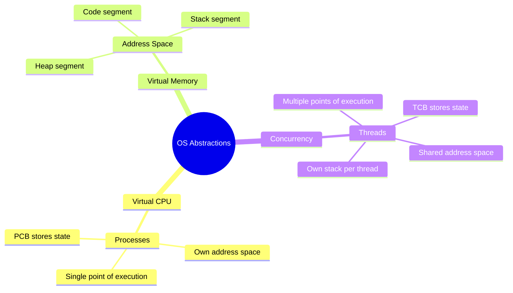

---

## ⚡ Single-Threaded vs Multi-Threaded

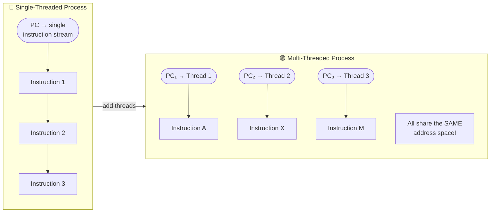

---

## 🧠 Thread State: What Each Thread Owns

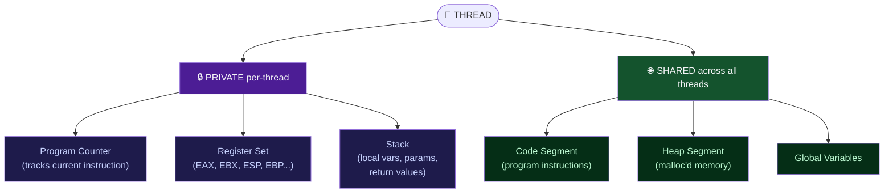

---

## ⚖️ Thread vs Process: Key Differences

| Property | Process | Thread |
|---|---|---|
| **Address Space** | Own (isolated) | **Shared** with other threads |
| **Page Table** | Own (switched on context switch) | **Same** — not switched! |
| **Control Block** | PCB (Process Control Block) | **TCB** (Thread Control Block) |
| **Stack** | Single stack | **One stack per thread** |
| **Context Switch Cost** | Heavyweight (TLB flush required) | **Lightweight** (registers only) |
| **Data Access** | Isolated | **Shared** → risk of race conditions |

---

## 🔄 Context Switch: Process vs Thread

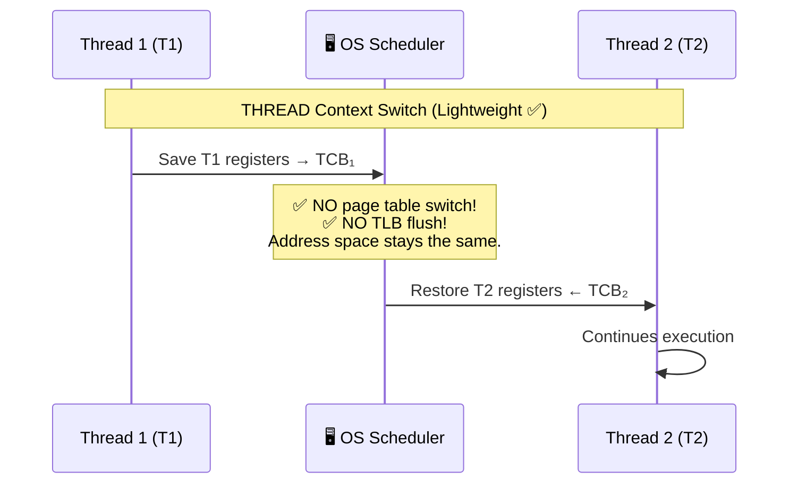

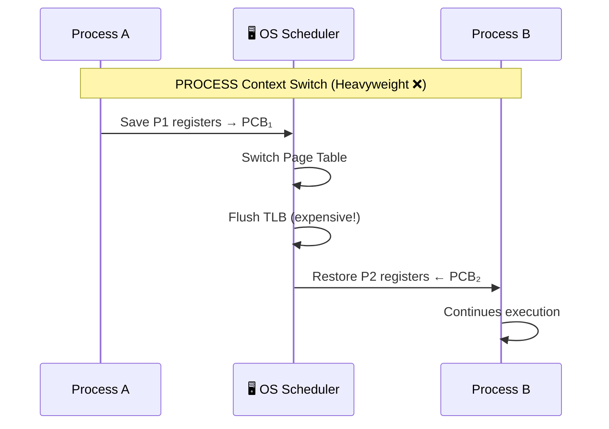

---

## 📦 Thread Control Block (TCB) Structure

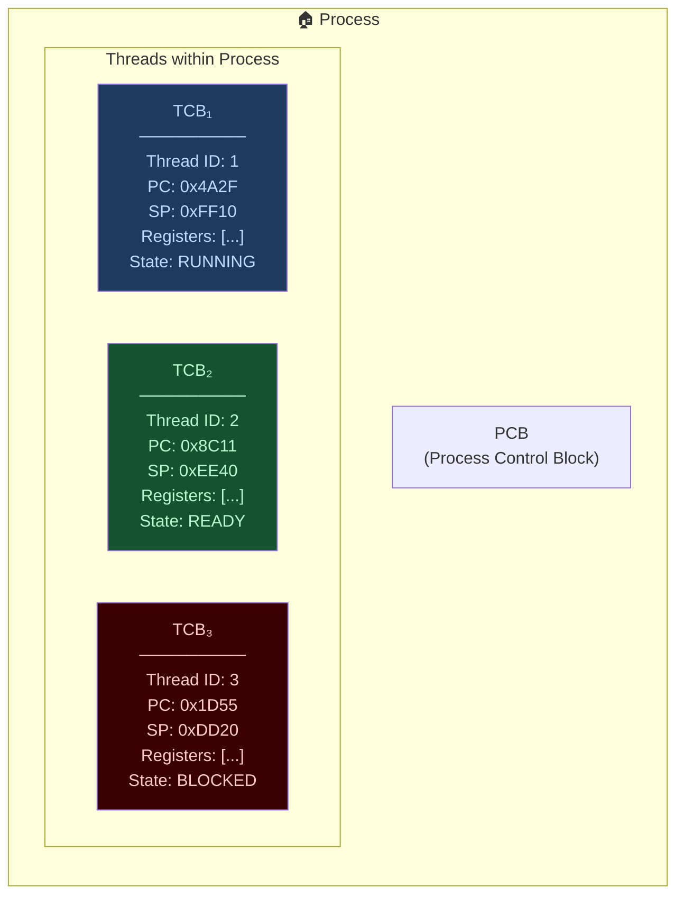

---

## 🏠 Address Space Layout: Single vs Multi-Threaded

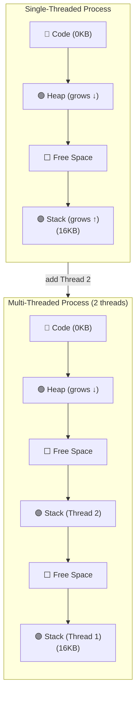

> ⚠️ Each thread gets its **own stack** = thread-local storage. Code + Heap are **SHARED**.

---

## 🔁 Thread Lifecycle (State Machine)

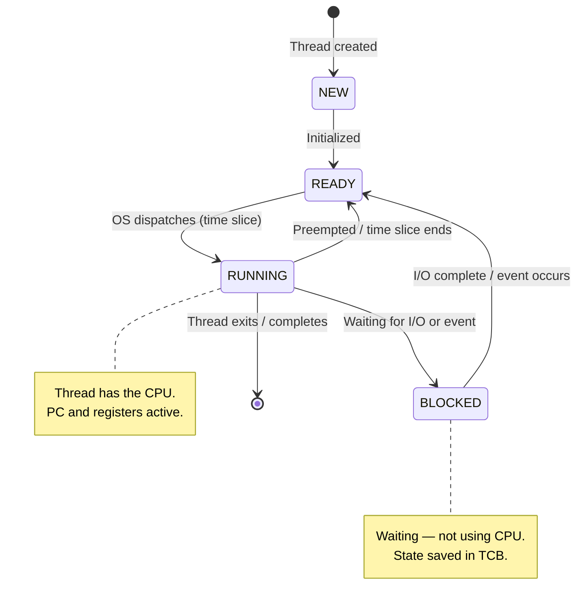

---

## ⚠️ The Concurrency Problem: Race Conditions

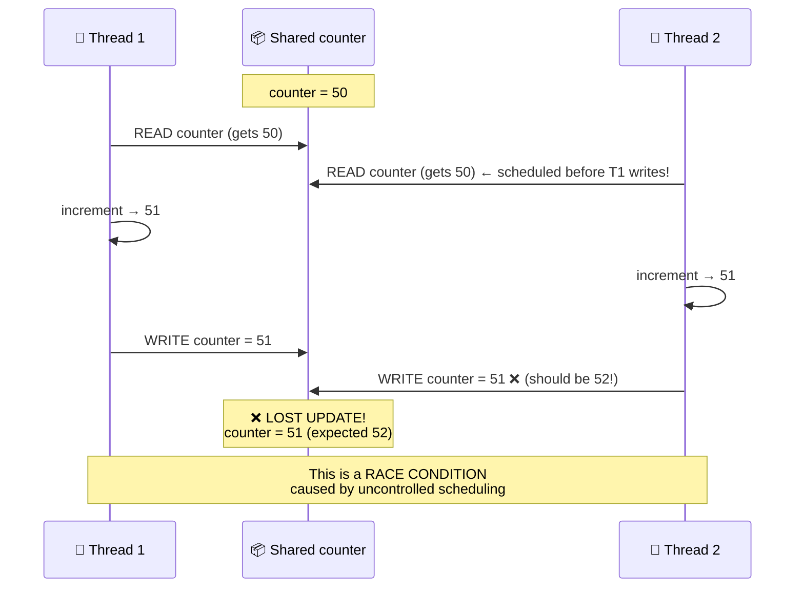

---

## 🛡️ Solutions to Concurrency Problems (Preview)

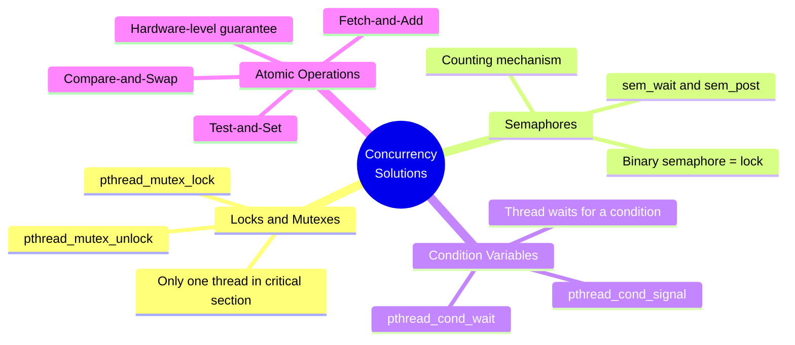

---

## 📋 Complete Concept Map

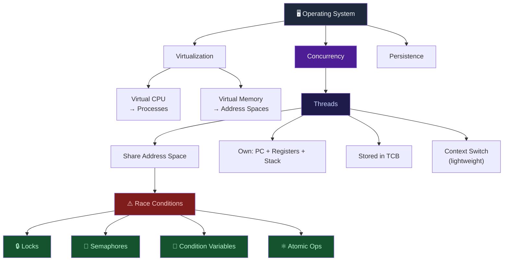

---

## 📝 Quick-Reference Cheat Sheet

| Term | Definition |
|---|---|
| **Thread** | Unit of execution within a process; shares address space |
| **Multi-threaded** | Program with multiple PCs (points of execution) |
| **TCB** | Thread Control Block — stores thread's saved register state |
| **PCB** | Process Control Block — stores process state |
| **Context Switch** | Save current thread state → restore next thread state |
| **Thread-local** | Data private to one thread (its own stack) |
| **Race Condition** | Bug from unsynchronized access to shared data |
| **Critical Section** | Code region accessing shared/mutable data |
| **Atomicity** | "All or nothing" — operation completes without interruption |
| **Shared Address Space** | Threads see the same code, heap, and globals |

---

## 🔗 Source

- **Course:** [Operating Systems: Virtualization, Concurrency & Persistence — Educative.io](https://www.educative.io/courses/operating-systems-virtualization-concurrency-persistence)
- **Chapter:** 20 · Concurrency and Threads
- **Lesson:** Introduction to Concurrency and Threads

---

> *Notes compiled for visual learning — every concept represented as a Mermaid diagram for maximum retention.*
